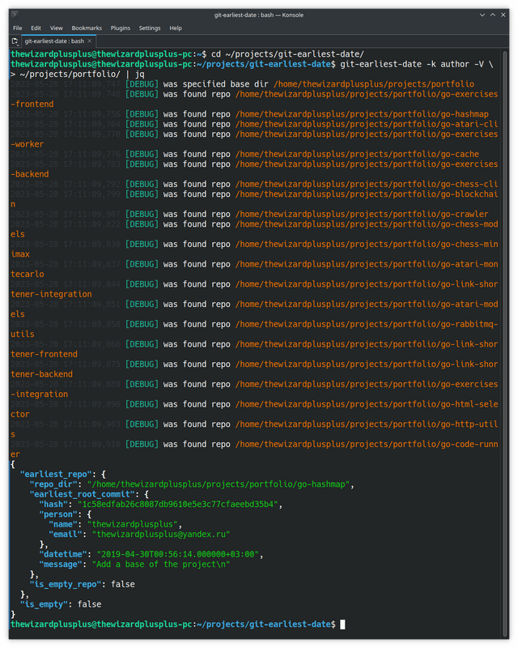

# git-earliest-date



The utility for searching the earliest root commit in a repository and the earliest repository in a repository group.

Repositories are searched recursively in the specified base directories. The earliest root commit and the earliest repository in a repository group are determined in the two ways: by author datetime and by committer datetime. Collected data are represented in the JSON format.

## Features

- repository search:
  - recursive search in the specified base directory;
  - support for specifying several base directories;
  - support for specifying a repository as a base directory;
- collecting data:
  - filter the results by person kind (optionally);
  - for a repository group:
    - full version:
      - repository list;
      - flag indicating that the repository list is empty;
      - earliest repository by the author datetime (may be null);
      - earliest repository by the committer datetime (may be null);
    - simplified version (by person kind):
      - earliest simplified repository (may be null);
      - flag indicating that the earliest simplified repository is null;
  - for a repository:
    - full version:
      - repo directory;
      - root commit list;
      - flag indicating that the root commit list is empty;
      - earliest root commit by the author datetime (may be null);
      - earliest root commit by the committer datetime (may be null);
    - simplified version (by person kind):
      - repo directory;
      - earliest simplified root commit (may be null);
      - flag indicating that the earliest simplified root commit is null;
  - for a commit:
    - full version:
      - hash (in the hexadecimal format);
      - author person;
      - author datetime (in the ISO 8601 format);
      - committer person;
      - committer datetime (in the ISO 8601 format);
      - message (may be empty);
    - simplified version (by person kind):
      - hash (in the hexadecimal format);
      - person;
      - datetime (in the ISO 8601 format);
      - message (may be empty);
  - for a person:
    - name (may be null);
    - email (may be null);
- support for repositories with several root commits (i.e., with orphan branches);
- use the optimal way for searching root commits (without full scan of a repository history);
- represent collected data in the JSON format.

## Installation

Clone this repository:

```
$ git clone https://github.com/thewizardplusplus/git-earliest-date.git
$ cd git-earliest-date
```

Then install the utility with the [pip](https://pip.pypa.io/) tool:

```
$ python3 -m pip install .
```

## Usage

```
$ git-earliest-date -v | --version
$ git-earliest-date -h | --help
$ git-earliest-date [options] [<base-dirs>...]
```

Positional arguments:

- `<base-dirs>` &mdash; a list of base directories with repositories (default: `["."]`).

Options:

- `-v`, `--version` &mdash; show the program version number and exit;
- `-h`, `--help` &mdash; show this help message and exit;
- `-k {AUTHOR,COMMITTER}`, `--by-kind {AUTHOR,COMMITTER}` &mdash; filter the results by person kind;
- `-V`, `--verbose` &mdash; verbose logging; can be specified several times: the more times, the more verbose.

## Result Data

Format of result data in the [JSON Schema](https://json-schema.org/) format: [docs/schemas](docs/schemas).

Example of result data: [docs/repo_info_group.example.json](docs/repo_info_group.example.json).

## Utilities

- [clean](tools/clean) &mdash; the utility for cleaning result data
- [validate-by-schema](tools/validate-by-schema) &mdash; the utility for validating result data by its JSON Schema

## License

The MIT License (MIT)

Copyright &copy; 2022 thewizardplusplus
